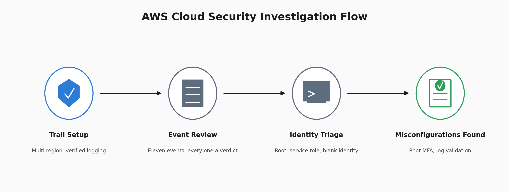

# AWS Cloud Security Investigation

Reading CloudTrail as an analyst, not an admin. Eleven events, three distinct identity patterns, and two misconfigurations found in the account's own audit trail.



## At a Glance

| Field | Detail |
| --- | --- |
| Investigation Type | Cloud security review, CloudTrail event analysis |
| Platform | AWS, account 446643829023 |
| Region | eu-north-1, Europe Stockholm |
| Trail | soc-investigation-trail, multi region |
| Log Storage | S3, aws-cloudtrail-logs-446643829023-5598fc6c |
| Events Reviewed | 11 management events |
| Outcome | No unauthorised access, 2 misconfigurations documented |

## What Happened

A CloudTrail trail was created across all regions, and every management event in the account was reviewed and given a verdict.

Nothing malicious was found. What was found is the account's own security posture written into its logs: the root account being used without MFA, and log file validation switched off.

The interesting part of a cloud investigation is not the volume. Eleven events is nothing. It is that every event looks like a username doing a thing, and much of the time the username is not a person at all.

Scope stated plainly: this is a personal AWS account with a small event history, not an enterprise estate. What it demonstrates is the reading, not the scale.

## CloudTrail Setup


Console accessed, CloudTrail opened, multi region trail created and confirmed logging.

Multi region is not optional. A single region trail is a trail with blind spots, and an attacker who knows which region you watch will work in one of the other thirty.

## Trail Verification


Status confirmed as Logging. S3 bucket created for storage. Multi region coverage confirmed.

Verify the trail before trusting the evidence. A disabled trail is not an absence of activity, it is an absence of visibility, and those look identical from the console.

Disabling CloudTrail is itself an attacker move. If a trail is off, the first question is not what happened, it is who turned it off and when.

## Event History Review


All 11 management events across the last 90 days reviewed.

The User Name column shows three distinct patterns, not two. Root appears on three events, creating the trail and its storage bucket. A user called onboarding appears on several resource-explorer events. Two events, AutomatedDefaultVpc and CreateDefaultVpcResource, show no username at all, only a source of ec2.amazonaws.com.

Root actions traced to the account owner. The onboarding identity and the blank identity both needed explaining before anything could be cleared, for different reasons, one is a named service role and the other has no identity field populated at all.

Every event gets a verdict. An event nobody looked at is not a clean event, it is an unread one.

## Investigating the Unknown User


The onboarding user performed an AssociateDefaultView event.

A username nobody created is exactly the thing that ends an investigation early in the wrong direction. Reading the full JSON is what settles it.

The record showed:

User type: AssumedRole, an AWS service role rather than a human identity.

Source IP: resource-explorer-2.amazonaws.com, an AWS internal service endpoint.

Verdict: AWS Resource Explorer configuring itself. Not suspicious.

This is the cloud specific skill. On a Linux box a username is a person. In AWS a username is often a service assuming a role, and the only way to tell is the identity type and the source in the JSON. The console view shows you the name. The JSON shows you what the name is.

## Investigating the Blank Identity

The AutomatedDefaultVpc and CreateDefaultVpcResource events show no username field populated, only a dash where a name would be, and an event source of ec2.amazonaws.com.

That absence is its own signal. A blank identity field alongside an AWS service source is consistent with default resource creation the platform performs automatically for a new account or a new region, rather than any credential being used at all. It is a different pattern from onboarding, which had a named role and a specific identity type to check. Here there is no identity to check, and that itself is the thing worth confirming rather than assuming.

Verdict: AWS automated default VPC provisioning. Not a credential based action, not suspicious.

## Finding, Root Used Without MFA


The CreateTrail event was performed by the root user from 197.254.137.4.

The JSON returned `mfaAuthenticated: false`.

The root user performed this management action without MFA authentication. AWS root credentials have full access to account resources by default, and ordinary IAM policies cannot explicitly deny the root user. Because of that privilege level, root activity without MFA authentication is the highest severity configuration finding in this investigation.

This session's own record establishes `mfaAuthenticated: false` for this specific event, not that MFA is absent from the account as a whole, a session level finding and an account level finding are different claims. 197.254.137.4 is the analyst's own known IP address on this personal lab account, which is how this is known to be authorised activity rather than an intrusion. That is the analyst's own knowledge of the account, not a geolocation or WHOIS determination made from the log data itself, the JSON does not contain anything that independently proves whose IP address this is. It is still the highest severity item here, because the control that would stop an intrusion is the one that is missing.

## Finding, Log File Validation Disabled

Log file validation was not enabled on the trail.

CloudTrail log file validation works by generating signed digest files alongside the delivered logs, which allow modification or deletion of a log file after delivery to be detected. Without it enabled, that detection mechanism does not exist for this trail, there is no signed record to check a log file against if its integrity is ever in question.

That is a narrower claim than saying an attacker could freely rewrite the trail. Whether a log file could actually be altered also depends on the permissions set on the underlying S3 bucket, which this investigation did not separately check. What validation being off does establish is that if tampering occurred, there is currently no built in way to detect it. This finding is quieter than the root one, and it still matters, because it means the account cannot currently prove its own evidence is intact.

## Findings Summary

| # | Finding | Severity | Status |
| --- | --- | --- | --- |
| 1 | Root account used without MFA | High | Remediation required |
| 2 | Log file validation not enabled | Medium | Remediation required |
| 3 | onboarding user activity | Cleared | AWS Resource Explorer service, verified in JSON |
| 4 | AutomatedDefaultVpc and CreateDefaultVpcResource, no username | Cleared | AWS automated activity, blank identity field consistent with platform provisioning |

Two of these are findings and two are cleared. Both cleared entries were investigated to a verdict, not assumed.

## Observations

| Type | Value | Verdict |
| --- | --- | --- |
| User | root | Used without MFA, high severity |
| Source IP | 197.254.137.4 | Analyst's own known IP on this personal account, not independently verified from the log data |
| User | onboarding | AWS Resource Explorer service role, cleared |
| User | (blank) | AWS default VPC provisioning, cleared |
| Trail | soc-investigation-trail | Created for this investigation |

## MITRE ATT&CK Context

No adversary technique was observed in this project. The event history shows configuration weaknesses, not adversary behaviour, and the two techniques below describe what those weaknesses expose the account to, not anything an attacker was seen doing.

Root was used for a management task without MFA authentication. T1078.004 Cloud Accounts is relevant threat context because adversaries can abuse valid cloud credentials, but no adversary use of the root account was observed in this investigation.

Log validation being off means tampering with the trail, if it occurred, would not currently be detected. That maps to Impair Defences, Disable Cloud Logs, T1562.008.

## Analyst Conclusion

11 CloudTrail events reviewed, every one assigned a verdict.

No unauthorised access detected.

Root account used without MFA. Highest severity finding in the account.

Log file validation disabled, meaning tamper detection is not active on the audit trail.

The onboarding user is an AWS service role, confirmed from the identity type and source endpoint in the JSON. Two further events with no populated username are attributable to AWS default VPC provisioning based on their event source, a different identity pattern from onboarding but the same discipline applied to clear it.

All activity attributable to the account owner or to AWS automation.

## Recommended Response

Enable MFA on root immediately. It is the single control with the largest blast radius in the account.

Stop using root for routine work. Create an IAM admin user and reserve root for the handful of tasks that require it.

Enable log file validation on the trail so the evidence can prove it is intact.

Enable GuardDuty so detection is not dependent on someone reading event history by hand.

## What This Lab Demonstrates

Configuring a multi region CloudTrail and verifying it before trusting its output.

Reading CloudTrail JSON rather than the console summary.

Distinguishing an AWS service role from a human identity, which is the mistake cloud investigations turn on.

Recognising that a blank identity field is a different pattern from a named service role, and clearing each on its own evidence rather than treating all unusual usernames the same way.

Investigating an unknown username to a verdict instead of clearing it or escalating it on the name alone.

Identifying the two misconfigurations that matter most in an AWS account and explaining why they rank the way they do.

Assigning a verdict to every event, including the ones that turned out clean, and being precise about which verdicts came from the log data and which came from the analyst's own knowledge of the account.

## Lessons Learned

The event history table showed three distinct identity patterns in its User Name column, and the first pass through this write up only accounted for two. Root and onboarding both had names to notice. The blank identity field on the two AutomatedDefaultVpc and CreateDefaultVpcResource events was easy to read past precisely because it had nothing written in it, and a blank field does not announce itself as something requiring investigation the way an unfamiliar name does.

The same discipline that cleared onboarding, checking the identity type and source rather than the name, applied just as well to an identity with no name at all. The absence needed the same verdict a name would have needed, not an exemption from one.

A related lesson came from the root IP address. Knowing an IP belongs to the account owner because it is your own account is real knowledge, but it is a different kind of claim than tracing an IP through investigative evidence, and the two should not be written the same way.

## What I Would Improve

I would add automated monitoring for unusual CloudTrail activity so the investigation does not depend entirely on manually reviewing Event History, a method that stops scaling well past a small personal account.

I would document the process for confirming a source IP belongs to the account owner, even informally, so that claim is reproducible by someone other than the analyst who already knows the account.

I would enable both remediations, MFA on root and log file validation, and capture a follow up screenshot showing them active, so the repository demonstrates the fix rather than only the finding.

## Repository Structure

```text
.
├── README.md
└── screenshots/
    ├── 00_architecture.png
    ├── 01_aws_console_dashboard.png
    ├── 02_cloudtrail_homepage.png
    ├── 03_cloudtrail_create_form.png
    ├── 04_cloudtrail_active.png
    ├── 05_event_history.png
    ├── 06_all_events.png
    ├── 07_event_details_p1.png
    ├── 07_event_details_p2.png
    ├── 07_event_details_p3.png
    ├── 08_createtrail_p1.png
    ├── 08_createtrail_p2.png
    └── 08_createtrail_p3.png
```

---

## Author

William Gokah

SOC Analyst Portfolio

[](https://linkedin.com/in/WilliamInCyber) [](https://x.com/WilliamInCyber)
